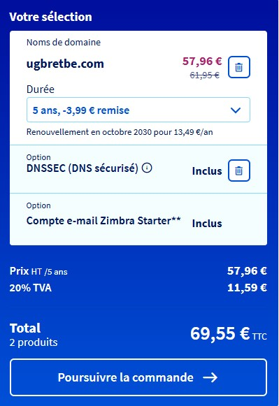
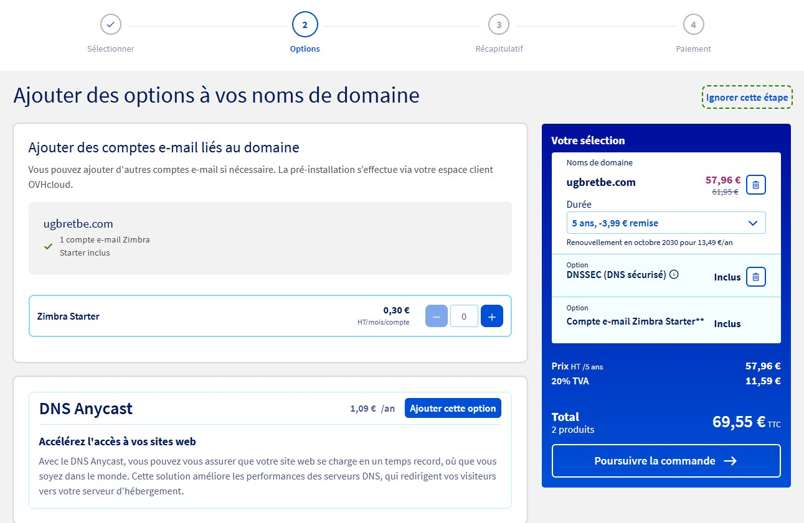
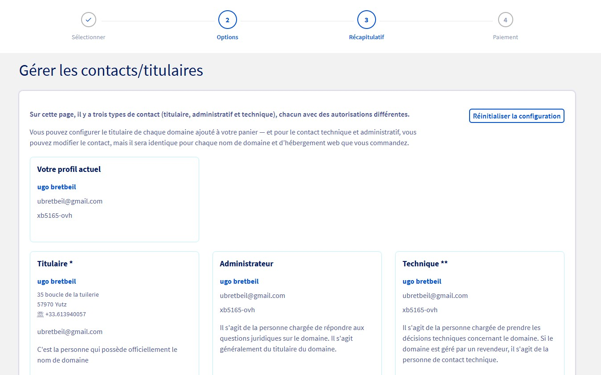
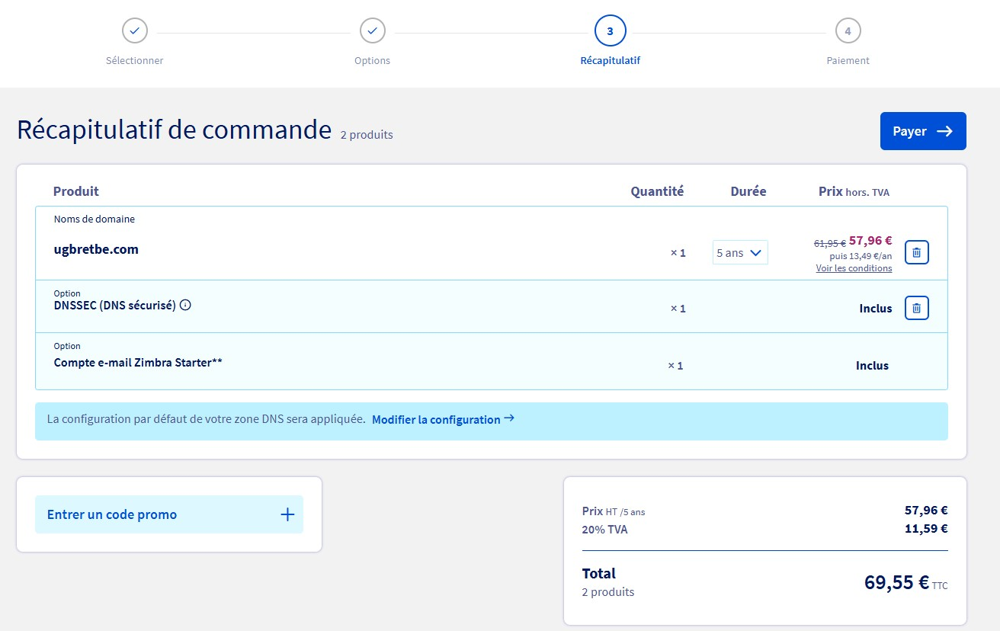

# Questions

Répondez ici aux questions théoriques en détaillant un maxium vos réponses :

## 1. Expliquer la procédure pour réserver un nom de domaine chez OVH avec des captures d'écran (arrêtez-vous au paiement) :

- Se rendre sur le site : https://www.ovhcloud.com/fr/domains/
- Entrer le nom de domaine souhaité dans le champ "Trouver votre nom de domaine"


- Choisir le nom de domaine avec l'extension souhaité (pour notre part ugbretbe.com)


- Cliquer sur "Acheter"
- Le nom de domaine s'ajoute au panier



- Cliquer sur "Poursuivre la commande"
- On peut ajouter un hébergement web mais nous allons ignorer cette étape


- On peut également ajouter des options que nous allons ignorer



- On se connecte ensuite à notre compte OVH


- On a ensuite un récapitulatif des titulaires du nom de domaine, on peut soit rester le propriétaire partout, soit ajouter d'autres personnes



- On peut Continuer
- On a ensuite le Récapitulatif de la commande, si tout est bon on peut payer



- Il faut ensuite accepter les termes et conditions puis payer

## 2. Comment faire pour qu'un nom de domaine pointe vers une adresse IP spécifique ?

Sur le site de l'hébergeur, il faut ajouter un enregistrement A au nom de domaine. Dans cet enregistrement on va mettre l'adresse IP.
@ 10800 IN A 172.17.4.4
Cet enregistrement est un exemple qui fait pointer le nom de domaine nu vers l'adresse ip 172.17.4.4, sans prendre en compte les sous-domaines

## 3. Comment mettre en place un certificat SSL ?

On peut passer par Certbot qui peut mettre en place le certificat SSL pour nous :

- Il faut d'abord installer snapd avec la commande :

```
sudo apt install snapd
```

- Installer certbot :

```
sudo snap install --classic certbot
```

- Vérifier que le certbot fonctionne correctement :

```
sudo ln -s /snap/bin/certbot /usr/bin/certbot
```

- Lancer certbot :

```
sudo certbot --nginx
```

- Vérifier que le renouvellement des certificats est mis en place :

```
sudo certbot renew --dry-run
```

- Fini
